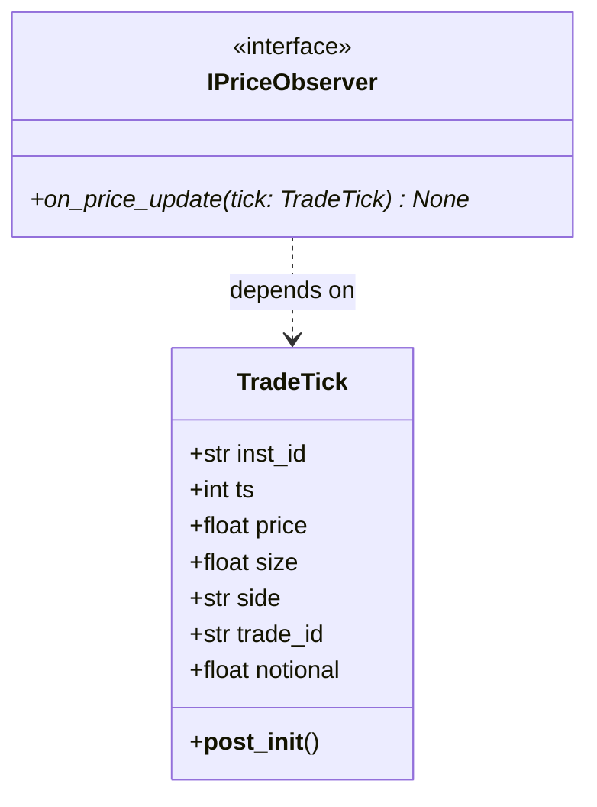

# Leviathan Common 🐳

[](https://www.python.org/)
[](#)
[](#)
[](#)
[](#)

The **Leviathan Common** subsystem serves as the shared foundation library for the entire Leviathan algorithmic quantitative trading platform. It aggregates fundamental immutable data models, inter-component communication interface contracts, and low-level mathematical and formatting utilities.

---

## 🏗️ System Architecture & Models

This module is engineered to be minimalist, highly stable, and completely free of external dependencies, serving as a clean anchor point for all other platform modules (streamers, footprints, and application).



### Key Components
1. **[TradeTick](file:///c:/Users/emman/Documents/python/leviathan-system/subsystems/leviathan_common/leviathan_common/models/trade_tick.py):** Standardized, immutable, and self-validating representation of an exchange trade event.
2. **[IPriceObserver](file:///c:/Users/emman/Documents/python/leviathan-system/subsystems/leviathan_common/leviathan_common/interfaces/base.py):** Core interface of the **Observer** pattern enabling decoupled asynchronous data processing.
3. **[utils.py](file:///c:/Users/emman/Documents/python/leviathan-system/subsystems/leviathan_common/leviathan_common/utils.py):** A library of deterministic time-parsing and price-formatting utility functions.

---

## 📜 Software Quality Charter (The 11 Pillars)

This subsystem strictly adheres to the platform's academic software quality charter:

1. **Design by Contract (DbC):** The `TradeTick` class strictly enforces its business invariants (positive timestamps, price, and sizes, conforming sides) at initialization via `__post_init__`.
2. **Strict Encapsulation (Immutability):** `TradeTick` is decorated with `@dataclass(frozen=True)`, preventing any accidental modification of its attributes post-instantiation to ensure concurrent memory safety.
3. **Law of Demeter (Least Knowledge):** Data structures are flat and do not require method-chaining to access their intrinsic properties.
4. **Single Responsibility Principle (SRP):** Complete isolation of concerns: data structures (`models`), abstraction contracts (`interfaces`), and cross-cutting utility functions (`utils`).
5. **Low Coupling & High Cohesion:** Computational and price-formatting utility functions are 100% pure and deterministic, with zero global state or I/O side effects.
6. **Completeness:** The `TradeTick` model computes its own `notional` value, offering a complete API for downstream analytic consumers.
7. **Convenience:** The `parse_timeframe` utility handles both raw millisecond integers and standard string suffixes (`s`, `m`, `h`) interchangeably.
8. **Consistency:** Uniform exception handling, consistently throwing `TypeError` and `ValueError` with standardized descriptive messages.
9. **Clarity:** Method signatures explicitly document their preconditions and guarantee side-effect-free execution.
10. **Class Autonomy:** Domain models and utility functions are fully autonomous, validating themselves with no dependency on the outer Leviathan engine lifecycle.
11. **Testing Levels (100% Coverage):** Comprehensive test suite coverage verifying every precondition, postcondition, and edge case.

---

## 🧪 Running the Test Suite

You can validate this subsystem's unit test suite using pytest:

```bash
# Run common unit tests
pytest subsystems/leviathan_common/tests

# Generate code coverage report for this module
pytest subsystems/leviathan_common/tests --cov=leviathan_common --cov-report=term-missing
```

---

## 💻 Sample Code Spotlight

### Self-Validating Domain Model (DbC)
The data model validates its properties upon instantiation, ensuring malformed data cannot propagate through the system:

```python
from leviathan_common.models.trade_tick import TradeTick

try:
    # Attempt to instantiate with an invalid price
    tick = TradeTick(
        inst_id="BTCUSDT",
        ts=1715000000000,
        price=-100.0,  # Will raise ValueError (Invariant: price > 0)
        size=0.5,
        side="buy",
        trade_id="TX-12345"
    )
except ValueError as e:
    print(f"Validation Error: {e}")  # price must be positive, got -100.0
```

### Time & Numeric Utilities
```python
from leviathan_common.utils import format_price, parse_timeframe

# 1. Clean parsing of timeframe durations
duration_ms = parse_timeframe("5m")
print(f"5 minutes = {duration_ms} ms")  # 300000 ms

# 2. Precise price formatting according to tick size rounding
formatted = format_price(67250.3129, tick_size=0.5)
print(formatted)  # "67250.3" (aligned on 1 decimal)
```

---
*Developed under proprietary standards by **TheRealDuBoySem**. Engineered to guarantee the robustness and stability of the Leviathan financial data structures.*
